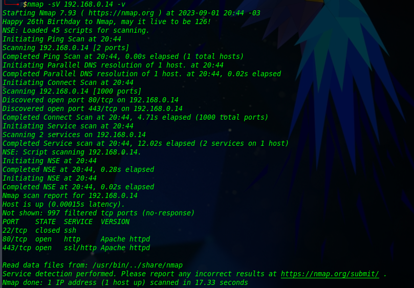
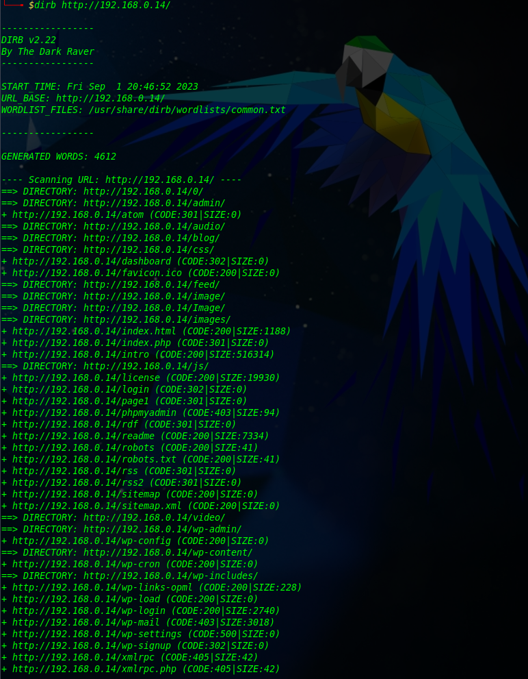
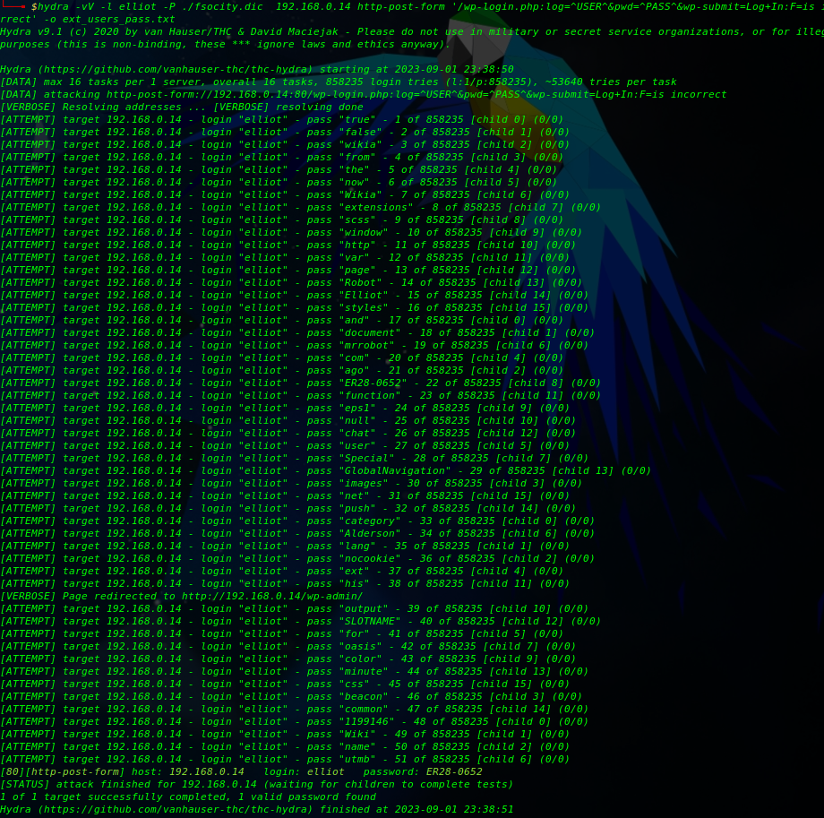
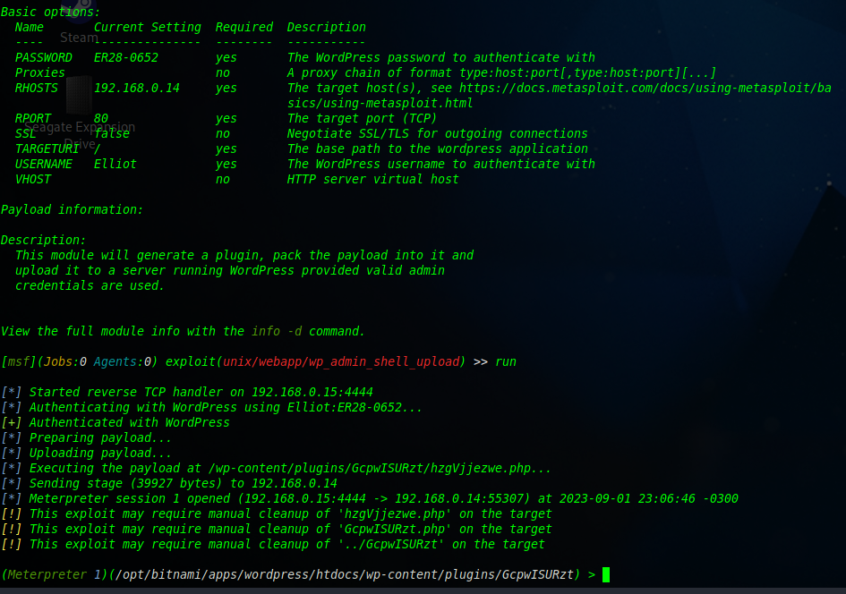
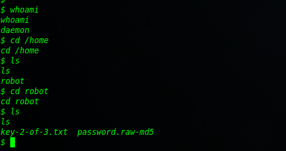

# Pentesting maquina virtual Vulnhub

### Objetivo

- Vulnerar máquina virtual "MR-ROBOT: 1"
- Obtener tres keys (Flags)

### Resumen

### Detalles técnicos

> SO: Linux - Parrot

> Sofwares

>      - nmap
>      - dirbuster
>      - nikto
>      - hydra
>      - msfconsole
>      - hashcat
>      - meterpreter
>      - python
>      - navegador web
 

### Análisis y Acciones llevadas a cabo

1) Recopilación de información
   1) Se utilizó nmap para verificar el IP del objetivo
      1) Utilizando nmap -n -sn < IP.0/24 > con el fin de evitar la resolución dns (disminuyendo el ruido) y generando un Ping Sweep Echo Request (verificando la conectividad y disponibilidad).
      2) Comparando con ifconfig, se determino la ip del objetivo
      3) Con el comando nmap -sV < IP > se obtuvieron los puertos abiertos, el estado de los mismos y los servicios-version de software
      4) El resultado de estas operaciones determinó la IP y que se encuentra abiertos los 80-442 y el puerto 22 cerrado. A su vez se observa que se corre la versión Aache httpd en puerto 80 y 443. De modo que al tener el puerto 80 abierto se decidió acceder a través del navegador, verificando que efectivamente se tiene una web activa.
   2) Se ejecutó dirbuster y nikto para descubrir directorios y archivos ocultos no denegados correctamente o posibles vulnerabilidades.
      1) Comando ejecutado: dirb http://< IP >/ 
      2) Comando ejecutado: nikto -h < PI >
      3) A partir de los resultados se detectó lo siguiente:
         1) Se tiene una runta /admin
         2) Ruta /wp-admin, lo que supone que el sitio esta desarrollado con wordpress
         3) /robots.txt dio lugar a dos rutas fsocity.dic Y key-1-of-3.txt
            1) Se accedió al primero y se obtuvo una lista de posibles usuarios
            2) La segundo dió la primer meta, es decir el flag 1: > 073403c8a58a1f80d943455fb30724b9
         4) De lo anterior se extrajo en un archivo los resultados de fsocity.dic.
         5) Como el servidor hace referencia a la serie de Mr. Robot, se procedió a obtener una lista de los personajes y palabras claves a partir de un link con selenium y luego acotar la misma comparando con el archivo fsocity.dic encontrado.
   3) Teniendo presente el archivo extraído (donde se tienen posibles usuario) y sabiendo que se trata de una aplicación de wordpress (/wp-admin), se ejecuta hydra con el fin de realizar un ataque de fuerza bruta para encontrar posibles credenciales de autenticación y posteriormente intentar escalar privilegios de usuario.
      1) A partir de los resultados se obtuvieron una serie de posibles contraseñas y usuarios de los cuales se volvió a ejecutar particularmente para cada uno dando lugar a resultado positivo con uno de ellos.
2) Explotación y escalado de privilegios
   1) Para lograr este objetivo se utilizó metasploit framework y el exploit  < exploit/unix/webapp/wp_admin_shell_upload > ya que se trata de una aplicación de wordpress. En este caso en particular, por configuracion básica, se desactivo WPCHECK.
   2) Lo anterior permitió permitió obtener acceso al sistema objetivo y establecer conexión inversa.
   3) Ya en la consola de meterpreter se ejecuto un script en python (pty) para emular una terminal interactiva.
   4) A partir de comandos linux se determino el usuario actual. Se accedió al directorio /home/robot, donde se encontraron dos archivos, x, y, la cual una contenía un password, que por su extención se verifica que tenía cifrado md5 y el otro archivo el segundo flag, que para acceder requeríamos los permisos del usuario y por lo tanto descifrar el password anterior.
   5) A patir del password cifrado, se utilizó hashcat para desencriptar y obtener la misma, lo cual fué exitoso.
   6) Se accedió a ejecutar el permiso del usuario y luego acceder al contenido del flag 2: > 822c73956184f694993bede3eb39f959.
   7) Para encontrar el último flag, se procedió a verificar archivos que tengan el setuid o setguid establecido, es decir que se permita ejecutar con permisos de propietarios o de grupo en lugar de permisos de usuario logueado. Se encontro que en la lista se encuntra nmap (no debería estar) por lo que se procedio a ejecutarlo y acceder a la terminal interactivad nmap.
   8) Se ejecuto sh para generar una shell y navegar hasta el directorio de root/, donde se encuentra el 3er flag: > 04787ddef27c3dee1ee161b21670b4e4

### Anexo - Evidencias

### Fuentes

- https://github.com/frizb/Hydra-Cheatsheet
- https://github.com/vanhauser-thc/thc-hydra
- https://www.vulnhub.com/entry/mr-robot-1,151/
